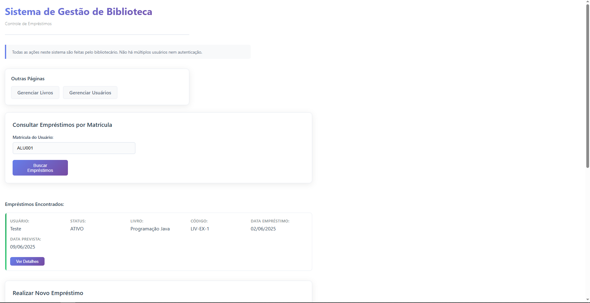
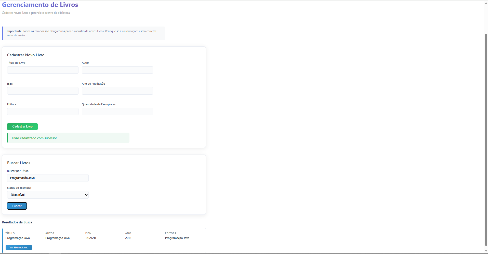
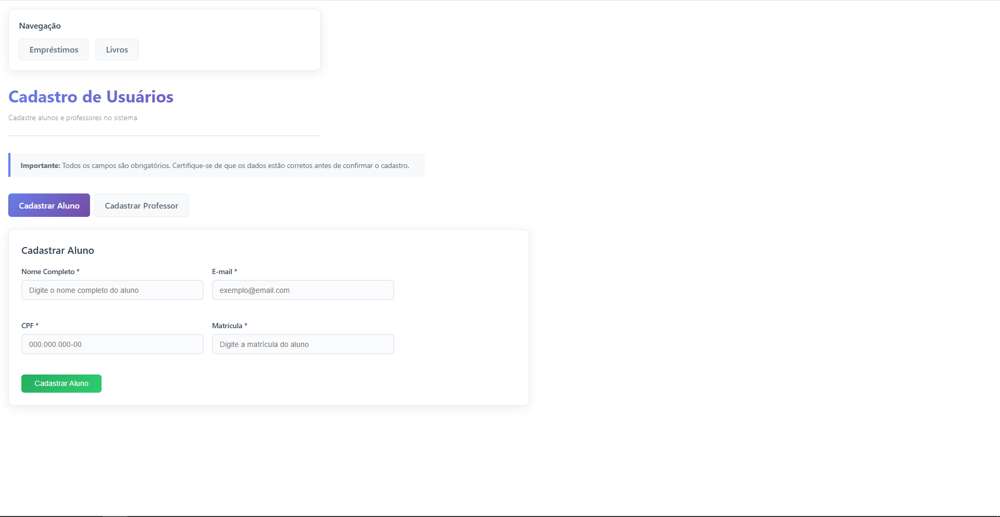
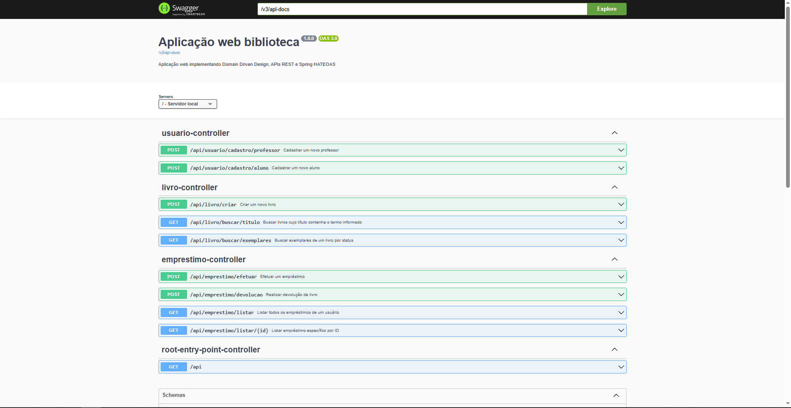

# 📚 Sistema de Gerenciamento de Biblioteca

Este projeto é um **Sistema de Gerenciamento de Biblioteca** modularizado e orientado a domínios, implementado em **Java 21+** com **Spring Boot**. O objetivo principal é fornecer APIs RESTful robustas para cadastro de livros, usuários (alunos e professores), controle de empréstimos/devoluções e navegação HATEOAS entre os recursos. A arquitetura foi desenhada para ser facilmente extensível, testável e aderente às boas práticas de Domain-Driven Design (DDD).

---

## 🚀 Visão Geral das Tecnologias

- **Java 21+**
- **Spring Boot** (versão 3.x)
    - **Spring Web** (MVC e REST)
    - **Spring Data JPA** (persistência com JPA/Hibernate)
    - **Spring HATEOAS** (hipermídia nos endpoints REST)
- **Lombok** (redução de boilerplate em entidades, DTOs e classes de serviço)
- **H2 Database** (banco em memória para ambientes de desenvolvimento/teste)
- **Swagger / Springdoc OpenAPI** (documentação automática de API)
- **Maven Wrapper** Para build
---

## ⚙️ Motivação e Escolhas Técnicas

1. **Arquitetura Orientada a Domínios (DDD-Inspired)**
    - Camadas bem definidas:
        - **API Layer** (`api/`): Controllers REST e ponto de entrada HATEOAS (`RootEntryPointController`).
        - **Application Layer** (`application/`): DTOs (`dto/`) e casos de uso (`usecase/`).
        - **Domain Layer** (`domain/`): Entidades, enums, interfaces de repositório e regras de negócio.
        - **Infrastructure Layer** (`infrastructure/config/`): Configurações (Swagger).
    - Essa separação permite isolar regras de negócio do acesso a banco, facilitando testes automáticos e manutenção.

2. **HATEOAS (Spring HATEOAS)**
    - Cada recurso REST devolve representações com links (`self`, relacionamentos, ações disponíveis).
    - O `RootEntryPointController` atua como ponto de entrada “raiz” da API, fornecendo links para coleções principais (usuários, livros, empréstimos).
    - Facilita a navegação programática pelo cliente (por exemplo, front-ends interativos ou microserviços) sem conhecer URLs fixas.

3. **DTOs e Mapeamento**
    - **DTOs** (`application/dto/`) garantem desacoplamento entre modelos de domínio e payloads REST.
    - Evita exposição direta das entidades JPA e permite controle fino sobre quais campos são serializados.

4. **Banco H2 (In-Memory)**
    - Facilita testes locais e inicialização rápida: sem necessidade de configuração externa, foi escolhido em função do projeto ser acadêmico.
    - Em produção, pode ser substituído facilmente por um banco relacional (PostgreSQL, MySQL, etc.) apenas ajustando configurações em `application.yml`.

5. **Swagger (OpenAPI)**
    - Documentação automática de todos os endpoints.
    - Interface interativa em `/swagger-ui.html` para explorar e testar recursos diretamente.

6. **Lombok**
    - Reduz código boilerplate em *getters*, *setters*, *constructors*, *builders*, *equals/hashCode* etc.
    - Torna classes de entidade e DTOs mais concisas.

---

## 📷 Capturas de Tela da Interface (UI)

### Tela Inicial: Gerenciamento de Empréstimos

### Tela de Gerenciamento de Livros

### Tela de Gerenciamento de Usuarios

### Swagger UI

